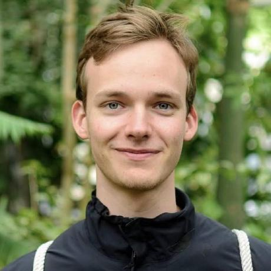

# Jacob Ungar Felding

  
  

    <strong>LinkedIn:</strong> <a href="https://www.linkedin.com/in/jacob-ungar-felding/">jacob-ungar-felding</a> 
    <strong>GitHub:</strong> <a href="https://github.com/jfelding">jfelding</a>
  

## Education 🎓
- **MSc in Computational Physics**
  - Niels Bohr Institute, Copenhagen
  - 2019–2021
  - GPA: 11.7/12.0
  
- **BSc in Physics**
  - Niels Bohr Institute, Copenhagen
  - 2015–2018
  - GPA: 10.6/12.0

## Experience 💼
### Data Scientist/Software Engineer
- **ATP**, Hillerød
- 04/2023–Present
- Responsibilities:
  - Computer vision projects on offline signature verification
  - Data mining, fraud detection
  - Data engineering and software development, Fullstack
- Skills: Python, SQL, JavaScript, Computer Vision, Document Processing, UI Frameworks

### Computer Vision Software Engineer
- **Videometer**, Herlev
- 01/2022–03/2023
- Responsibilities:
  - Developed new image processing methods and transformations for multi-spectral imaging
  - Optimized existing methods and worked on parallelization
  - Provided customer support and training
- Skills: C#, .NET, Python

### Supporter
- **Danske Bank**, Copenhagen
- 2018–2020
- Student job as a bank teller in the airport

## Technical Skills 💻
- **Languages:** C#, .NET, Python, C++, TypeScript, JavaScript, MATLAB
- **Version Control:** Git, SVN
- **Other Skills:** API programming, Linux, TensorFlow, PyTorch, OpenCV, Azure DevOps, Jamstack, ...

## Languages 🌐
- **Danish:** Native
- **English:** Academic level (TOEFL: 112/120)
- **German:** Basic

## Main Professional Interests 🔍
- Computer Vision
- Algorithm engineering and optimization
- Data analysis
- Machine learning
- Software development
- New technologies

## Hobby Interests 🕊
- Hydroponics: Gardening and herbs with a soil-less approach
- Music: Singing and playing the piano
- Kitchen Gadgets: Cooking and baking enthusiast
- Repairs: Enjoy fixing bikes, hardware, and designing replacement parts, volunteering at Repair Café Denmark

## Miscellaneous 🏆
- **Awards:**
  - Awarded 'Den Georgbruunske Pris' in 2022 for starting and revealing a case against Charlottenlund Lægehus for extensive overbilling of the public sector
  - Winner of the national history competition for secondary school students in 2012
